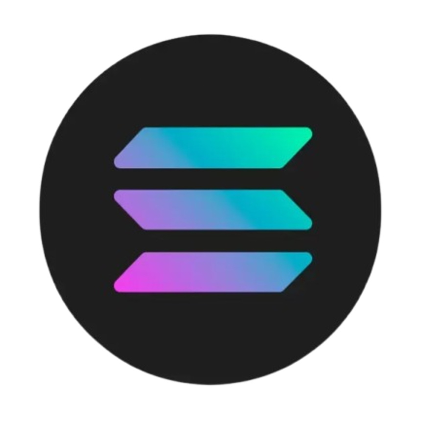
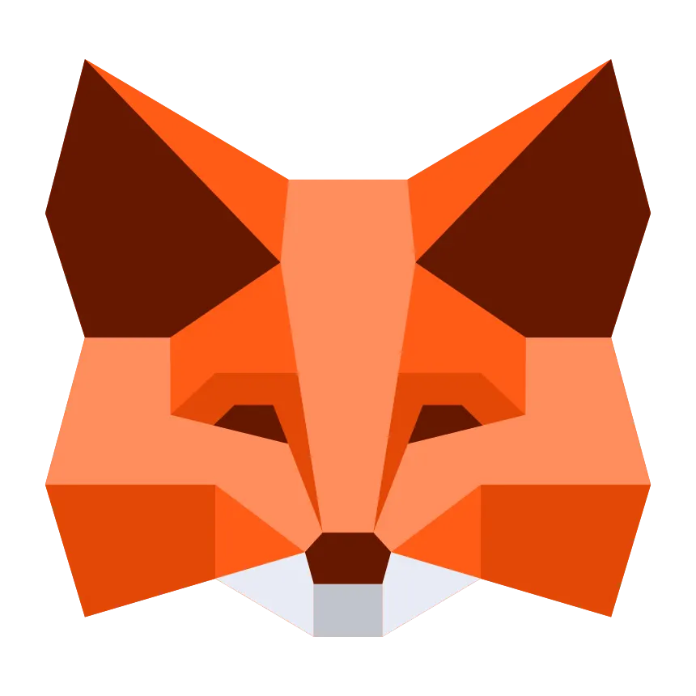

  

  <h1 style="color: white; margin-top: -80px;">Hey there, I'm Harit Choudhary 👋</h1>
  <h3 style="color: white;">🚀 Full-Stack Developer | 🔐 Blockchain Enthusiast | 💻 Java & Web Developer</h3>

  

    
  

---

## 🧬 About Me

### I'm Harit Choudhary — a B.Tech CSE student specializing in Blockchain at GLA University. I love building real-world applications using modern web technologies and exploring decentralized systems. From smart contracts to full-stack development, I’m constantly learning and improving my problem-solving skills.

---

## 🛠️ My Tech Arsenal

  
  
  
  
  
  
  
  
  
  

---

## 🔗 Web3 Stack

  
  
  
  
  
  
  

---

## 📊 GitHub Stats

<table style="border: none; border-collapse: collapse;">
  <tr>
    <td colspan="2" align="center" style="border: none;">
      
    </td>
  </tr>
  <tr>
    <td align="center" style="border: none;">
      
    </td>
    <td align="center" style="border: none;">
      
    </td>
  </tr>
</table>

---

## 👾 Pacman Contribution Graph

  

---

## 🌐 Let’s Connect

- 💬 Open to internships, collaborations, and Web3 projects

  
  
  
  

